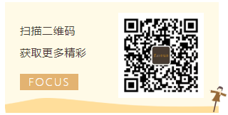

``` javascript
wechat.addEventListener('focus', function () {
  console.log('hello world!')
})
```

想必大家都是通过一句简单的 `hello world`，进入奇妙的编程世界。我也希望通过这句 `hello world`，带大家了解我们。


现在分享技术的公众号已经有太多太多，很多时候点一下收藏，之后不会再打开。

所以我们并不希望给大家分享枯燥的纯技术。希望带给大家的，更多的是在编程中的乐趣，要是能附带一两个简单的知识点，那就已经足够了。


## 目前公众号已启动专题：

Vue UI组件库


## 加入我们

如果你是刚入门的程序员，快来加入我们一起学习！

如果你已经是技术大牛，快来加入我们一起分享热爱！

如果你有能力，有想法，快来加入我们一起探讨！

此刻看到推送的你，对，就是你呀，快来加入我们吧！


对于程序员们来说，编程并不是只是一份工作，更是一份对编码的热情，对改变世界的小小期盼。当爱好恰好成为工作，这是一件多么幸福的事情。

每一位程序员，都值得被尊敬。


